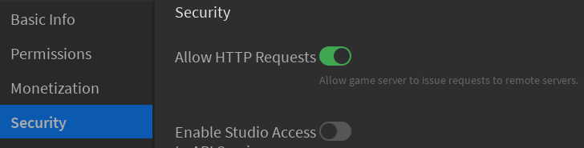
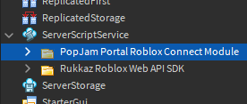
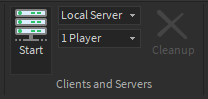
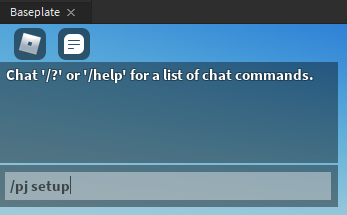
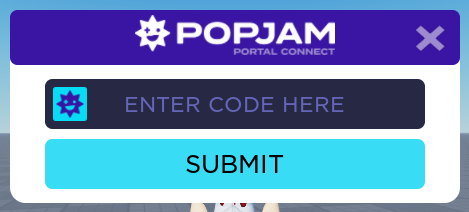

# PopJam Portal Roblox Connect Module v1.2.2

This module enables your game to host PopJam jam sessions. It facilitates acquisition of an event setup code from a player, usually a PopJam moderator. Using the [PopJam Portal Roblox Web API SDK](https://github.com/SuperAwesomeLTD/pj-portal-roblox-web-api-sdk/tree/PopJam-rebrand), this setup code is validated. Once validated, a server is reserved. The details are then submitted for use during the event.

[](https://github.com/SuperAwesomeLTD/pj-portal-roblox-connect-module/releases)

**Note:** Portions of the code make references to Rukkaz - don't worry, this module is still for PopJam!

## Installation

**tl;dr: Put the Folder in ServerScriptService**. Read on if you don't know how to do this:

1. Open the Experience in Roblox Studio.

2. Under the **Home** tab, click **Game Settings**. Security, enable **Allow HTTP Requests** if it is not already on. This is required for the web API, which is a dependency.

   
   - For unpublished games, enter this into the Command Bar instead:
   ```lua
   game:GetService("HttpService").HttpEnabled = true
   ```

3. Insert the model into the place using one of the following:

   - If you download the model file from [releases](https://github.com/SuperAwesomeLTD/pj-portal-roblox-connect-module/releases/latest): right-click ServerScriptService and select **Insert from File...**
   - If you took the Model on Roblox.com: insert it using the [Toolbox](https://developer.roblox.com/en-us/resources/studio/Toolbox)

4. Using the [Explorer](https://developer.roblox.com/en-us/resources/studio/Explorer), drag the "PopJam Portal Roblox Connect Module" Folder into [ServerScriptService](https://developer.roblox.com/en-us/api-reference/class/ServerScriptService).

   

5. That's it! Continue to "Testing" below.

More details about installation can be found in the [INSTALL](src/RukkazEventHost/INSTALL.lua) ModuleScript.

## Testing

1. Under the **Test** tab, click **Start** (F7)<sup>&dagger;</sup>

   

2. Type `/pj setup` into the chat.

   

3. The setup window should appear as below:

   

4. Enter an arbitrary 6-character setup code, which should be rejected: "The setup code you provided doesn't match any event."

5. Publish the game and repeat the process in a live Roblox game server.

&dagger;Don't click Play (F5): sometimes when testing in this way, the local player arrives before the module initializes. This can cause friction when testing.

## Configuration and Special Behavior

### Customizing Event Target Place ID

When setting up an event, the module assumes that the current place ([game.PlaceId](https://developer.roblox.com/en-us/api-reference/property/DataModel/PlaceId)) is the one to which event guests should be teleported. To change this, call `PopJamConnect.RukkazAPI:setEventHostPlaceIdCallback(func)`, where `func` is a function that returns the place ID to which guests must be sent. This must be done before calling `PopJamConnect:main`. See the [Main](src/Main.server.lua) script.

### Games which Teleport Players

During an event, guests are teleported to a private server created with [TeleportService:ReserveServer](https://developer.roblox.com/en-us/api-reference/function/TeleportService/ReserveServer) of the target game. So, if the target game needs to teleport players to another place, special steps must be taken to return guests back to the event private server. See **Data Store Usage** below.

## Data Store Usage

During event setup, the following data stores are used to save teleport data:

### `PopJamEventId`

Maps the private server ID (key) to the PopJam event ID (string). Used by `PopJamConnect:getHostedEventIdAsync` to detect if the current server is hosting a PopJam event by looking up its own private server ID.

### `PopJamTeleportDetails`

Maps a PopJam event ID (key) to a table containing private server teleport details with the following structure:

```plain
{
   "startPlaceId": "123456789",
   "placeIds": {
      "123456789": {
         "privateServerId": "...",
         "privateServerAccessCode": "..."
      },
      ...
   }
}
```

This allows looking up the private server id and access codes generated during event setup. It can be used to return players to the original private server if they were teleported away. In the future, it will also be used to store additional teleport details for private servers reserved for use during events.

## Dependencies

The dependencies of this module are included within it, which is only the [PopJam Portal Roblox Web API SDK](https://github.com/SuperAwesomeLTD/pj-portal-roblox-web-api-sdk/tree/PopJam-rebrand).

## Development

- Built using [Rojo 6](https://github.com/rojo-rbx/rojo). The main project file is [default.project.json](default.project.json).
- [selene](https://github.com/Kampfkarren/selene) is used as a linter. The files [selene.toml](selene.toml) and [roblox.toml](roblox.toml) are used by this.
