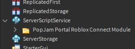

# PopJam Portal Roblox Connect Module

This module enables your game to host PopJam jam sessions. It facilitates acquisition of an event setup code from a player, usually a PopJam moderator. Using the [PopJam Portal Roblox Web API SDK](https://github.com/SuperAwesomeLTD/pj-portal-roblox-web-api-sdk/tree/PopJam-rebrand), this setup code is validated. Once validated, a server is reserved. The details are then submitted for use during the event.

## Dependencies

The module depends on the [PopJam Portal Roblox Web API SDK](https://github.com/SuperAwesomeLTD/pj-portal-roblox-web-api-sdk/tree/PopJam-rebrand). It must be available ServerScriptService.

## Installation

1. Open the Experience in Roblox Studio.
2. Under Home &rarr; Game Settings &rarr; Security, enable **Allow HTTP Requests** if it is not already on. This is required for the web API, which is a dependency.
   - You can also enter this into the command bar: `game:GetService("HttpService").HttpEnabled = true`
3. Insert the model file into the place using one of the following methods:
   - Take the Model on Roblox.com, and insert it using the [Toolbox](https://developer.roblox.com/en-us/resources/studio/Toolbox).
   - Download the model file from the releases section, then right-click ServerScriptService and select **Insert from File...**
4. Using the [Explorer](https://developer.roblox.com/en-us/resources/studio/Explorer), ensure the module is a child of [ServerScriptService](https://developer.roblox.com/en-us/api-reference/class/ServerScriptService).

Your ServerScriptService should now contain everything you need! :-)

## Test

1. Press **Play** (F5) in Roblox Studio.
2. Type `/pj setup` into the chat. Note: If the place does not have chat available, you must create some way for a player to have the server call `RukkazEventHost:setupCodePrompt(player)`
   
3. The setup window will appear as below:

Note: Sometimes when testing in Studio, the local player enters before the module can move things around, e.g. the client module into StarterPlayerScripts. This may cause some friction when testing - see `RukkazEventHost:main()`.

## Development

- Built using [Rojo](https://github.com/rojo-rbx/rojo) 6. The main project file is [default.project.json](default.project.json).
- [selene](https://github.com/Kampfkarren/selene) is used as a linter. The files [selene.toml](selene.toml) and [roblox.toml](roblox.toml) are used by this.
